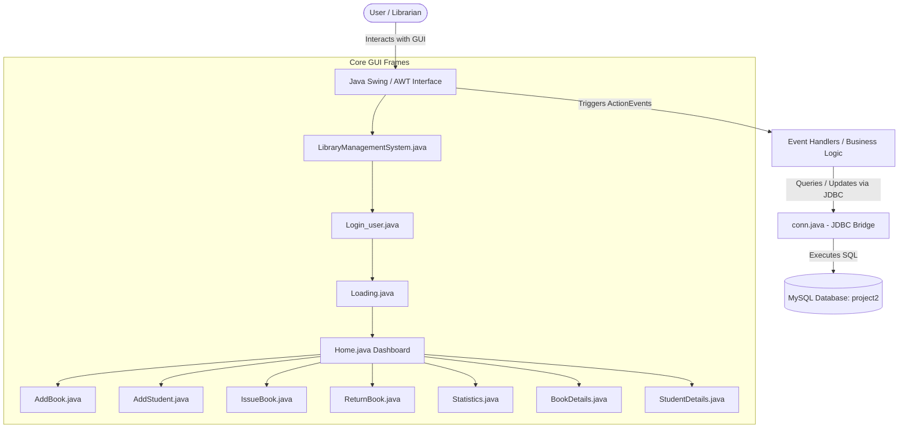
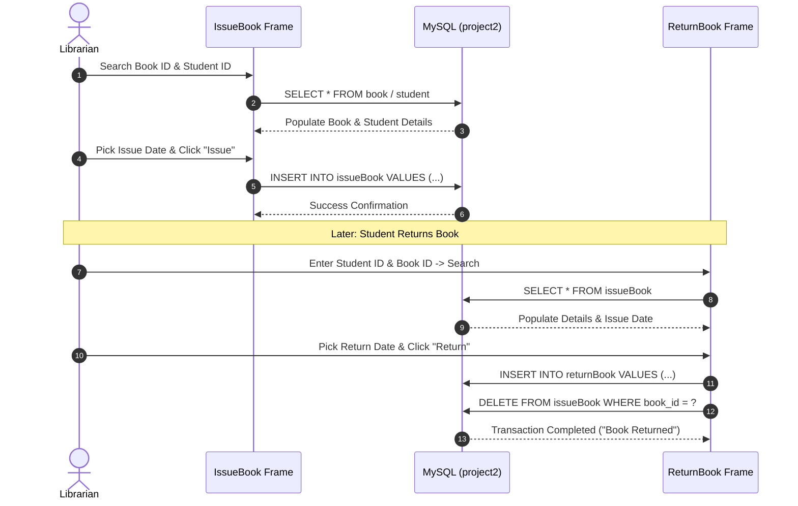

# 📚 OOP Library Management System

[](https://www.oracle.com/java/)
[](https://www.mysql.com/)
[](https://docs.oracle.com/javase/7/docs/api/javax/swing/package-summary.html)
[](https://netbeans.apache.org/)
[](https://www.wampserver.com/)
[](LICENSE)

> A desktop-based Object-Oriented Library Management System built with **Java Swing (GUI)** and **MySQL Database Connectivity (JDBC)**. Designed to streamline day-to-day library operations including book cataloging, student registrations, book issuance, return processing, and real-time transaction statistics.

---

## 📑 Table of Contents

- [Overview](#-overview)
- [Key Features](#-key-features)
- [Object-Oriented Programming (OOP) Architecture](#-object-oriented-programming-oop-architecture)
- [System Architecture & Flow](#-system-architecture--flow)
- [Technologies & Libraries](#-technologies--libraries)
- [Database Schema & SQL Script](#-database-schema--sql-script)
- [Project Directory Structure](#-project-directory-structure)
- [Installation & Setup Guide](#-installation--setup-guide)
- [Application Modules Walkthrough](#-application-modules-walkthrough)
- [Troubleshooting & FAQs](#-troubleshooting--faqs)
- [Future Enhancements](#-future-enhancements)
- [Contributing & License](#-contributing--license)

---

## 🌟 Overview

The **OOP Library Management System** automates the manual, paperwork-heavy processes typically involved in educational and institutional libraries. By integrating a clean, responsive graphical user interface (GUI) with a relational database backend, librarians can securely register accounts, track book inventories, manage student borrower records, issue and collect books, and audit transactions with ease.

---

## 🚀 Key Features

### 🔐 1. Authentication & Security
- **Secure Sign Up & Login:** Role-protected access allowing librarians to create accounts and log in securely.
- **Forgot Password Recovery:** Automated password recovery mechanism using security questions and secret answers.
- **Animated Loading Experience:** Visual progress bar indicator (`Loading.java`) running on a dedicated worker thread during system initialization.

### 📚 2. Book Inventory Management
- **Add New Books:** Catalog books with metadata including Book ID, Title, ISBN, Publisher, Edition, Price, and Page Count.
- **Searchable Book Directory:** Real-time search by Title or Book ID rendered dynamically into custom `JTable` components using `rs2xml`.
- **Delete Books:** Safe record deletion with confirmation dialog boxes.

### 🎓 3. Student Record Management
- **Student Enrollment:** Register student records including Student ID, Full Name, Father's Name, Course (e.g., B.Tech, BBA, BCA, B.Sc, M.Tech, MBA), Branch, Academic Year, and Semester.
- **Student Lookup & Deletion:** Instant lookup and management via the interactive Student Details table.

### 🔄 4. Book Circulation (Issue & Return)
- **Book Issuance (`IssueBook.java`):**
  - Instant metadata lookup for both the book and the borrowing student before issuing.
  - Interactive calendar widget (`JDateChooser`) to specify exact issue dates.
  - Automated record creation in the `issueBook` table.
- **Book Return (`ReturnBook.java`):**
  - Fast return lookup by combining `student_id` and `book_id`.
  - Captures the return date via `JDateChooser`.
  - Atomically records the return into the `returnBook` archive table while removing the entry from the active `issueBook` records.

### 📊 5. Audit & Statistics Dashboard
- **Dual Transaction Overview (`Statistics.java`):**
  - Upper Panel: Real-time table of all currently issued books.
  - Lower Panel: Historical log of all successfully returned books.

---

## 🏗️ Object-Oriented Programming (OOP) Architecture

The project leverages core OOP principles to maintain modular, readable, and maintainable Java code:

| OOP Principle | Implementation in Project |
| :--- | :--- |
| **Encapsulation** | UI component states, database credentials, and record field bindings are encapsulated within dedicated class instances. |
| **Inheritance** | All GUI frames inherit from `javax.swing.JFrame` (e.g., `public class Home extends JFrame`), utilizing Swing layout managers and component hierarchies. |
| **Polymorphism & Interfaces** | Implements standard Java interfaces such as `java.awt.event.ActionListener` for decoupled event-driven programming and `java.lang.Runnable` for multi-threaded progress tracking. |
| **Abstraction** | Database connectivity details are abstracted away through the centralized `conn` class (`conn.java`), exposing ready-to-use `Connection` and `Statement` objects. |

---

## 📐 System Architecture & Flow

### High-Level Architecture



### Circulation Workflow



---

## 🛠️ Technologies & Libraries

### Tech Stack
- **Programming Language:** Java (JDK 8 or higher)
- **GUI Framework:** Java Swing & Java AWT
- **Database Engine:** MySQL 5.7+ / 8.0+
- **Database Server:** WAMP Server / XAMPP / Native MySQL Server
- **IDE Support:** Apache NetBeans / IntelliJ IDEA / Eclipse

### Bundled External Libraries (JARs)
All required third-party libraries are located inside the `src/Jar/` directory:
- **`rs2xml.jar`:** Converts MySQL `ResultSet` objects into `TableModel` instances for seamless binding to `JTable` components (`DbUtils.resultSetToTableModel(rs)`).
- **`jcalendar-tz-1.3.3-4.jar`:** Provides the `JDateChooser` interactive date-picker GUI component.
- **`mysql-connector-java`:** Standard JDBC driver (`com.mysql.jdbc.Driver`) connecting Java applications with MySQL.

---

## 🗄️ Database Schema & SQL Script

The application connects to a MySQL database named **`project2`**.

### SQL Setup Script

You can copy and execute the script below in **phpMyAdmin**, **MySQL Workbench**, or the **MySQL CLI**:

```sql
-- Create Database
CREATE DATABASE IF NOT EXISTS project2;
USE project2;

-- 1. Account / Librarian Table
CREATE TABLE IF NOT EXISTS `account` (
  `username` VARCHAR(50) NOT NULL PRIMARY KEY,
  `name` VARCHAR(100) NOT NULL,
  `password` VARCHAR(100) NOT NULL,
  `sec_q` VARCHAR(150) NOT NULL,
  `sec_ans` VARCHAR(150) NOT NULL
) ENGINE=InnoDB DEFAULT CHARSET=utf8mb4;

-- 2. Book Inventory Table
CREATE TABLE IF NOT EXISTS `book` (
  `book_id` INT NOT NULL PRIMARY KEY,
  `name` VARCHAR(150) NOT NULL,
  `isbn` VARCHAR(50) NOT NULL,
  `publisher` VARCHAR(100) NOT NULL,
  `edition` VARCHAR(20) NOT NULL,
  `price` VARCHAR(20) NOT NULL,
  `pages` VARCHAR(20) NOT NULL
) ENGINE=InnoDB DEFAULT CHARSET=utf8mb4;

-- 3. Student Records Table
CREATE TABLE IF NOT EXISTS `student` (
  `student_id` INT NOT NULL PRIMARY KEY,
  `name` VARCHAR(100) NOT NULL,
  `father` VARCHAR(100) NOT NULL,
  `course` VARCHAR(50) NOT NULL,
  `branch` VARCHAR(50) NOT NULL,
  `year` VARCHAR(20) NOT NULL,
  `semester` VARCHAR(20) NOT NULL
) ENGINE=InnoDB DEFAULT CHARSET=utf8mb4;

-- 4. Issued Books Table
CREATE TABLE IF NOT EXISTS `issueBook` (
  `book_id` VARCHAR(50) NOT NULL,
  `student_id` VARCHAR(50) NOT NULL,
  `bname` VARCHAR(150) NOT NULL,
  `sname` VARCHAR(100) NOT NULL,
  `course` VARCHAR(50) NOT NULL,
  `branch` VARCHAR(50) NOT NULL,
  `dateOfIssue` VARCHAR(50) NOT NULL
) ENGINE=InnoDB DEFAULT CHARSET=utf8mb4;

-- 5. Returned Books Table
CREATE TABLE IF NOT EXISTS `returnBook` (
  `book_id` VARCHAR(50) NOT NULL,
  `student_id` VARCHAR(50) NOT NULL,
  `bname` VARCHAR(150) NOT NULL,
  `sname` VARCHAR(100) NOT NULL,
  `course` VARCHAR(50) NOT NULL,
  `branch` VARCHAR(50) NOT NULL,
  `dateOfIssue` VARCHAR(50) NOT NULL,
  `dateOfReturn` VARCHAR(50) NOT NULL
) ENGINE=InnoDB DEFAULT CHARSET=utf8mb4;
```

---

## 📁 Project Directory Structure

```text
OOP_Library_Management_System/
├── Diagrams/
│   └── Diagram.PNG                   # Architecture & system flow diagram
├── Documentation/
│   ├── Library Documentation.docx     # Detailed project specification document
│   ├── Project.docx                   # Project synopsis and requirements
│   └── REPORT.docx                    # Comprehensive project report
└── code/
    └── Library-Management-System/
        ├── README.md                  # Project documentation (this file)
        ├── build.xml                  # Apache Ant build script
        ├── manifest.mf                # Java manifest configuration
        ├── nbproject/                 # NetBeans IDE project configuration files
        └── src/
            ├── AddBook.java           # Book entry & cataloging GUI
            ├── AddStudent.java        # Student registration GUI
            ├── BookDetails.java       # Book inventory table with search & delete
            ├── Forgot.java            # Password recovery screen
            ├── Home.java              # Main navigation dashboard
            ├── IssueBook.java         # Book issuing workflow
            ├── LibraryManagementSystem.java # Splash/Entry screen (Main class)
            ├── Loading.java           # Multi-threaded loading progress bar
            ├── Login_user.java        # User authentication screen
            ├── ReturnBook.java        # Book return workflow
            ├── Signup.java            # User registration screen
            ├── Statistics.java        # Issued & returned transaction logs
            ├── StudentDetails.java     # Student records table with search & delete
            ├── conn.java              # Centralized JDBC connection manager
            ├── Jar/
            │   ├── jcalendar-tz-1.3.3-4.jar # Date picker calendar library
            │   └── rs2xml.jar               # ResultSet to TableModel converter
            └── icons/                 # UI icons, logos, and action buttons (.png, .jpg)
```

---

## 💻 Installation & Setup Guide

### 1. Prerequisites
Ensure you have the following software installed:
- **Java Development Kit (JDK 8 or later)**
- **WAMP Server**, **XAMPP**, or **MySQL Server**
- **NetBeans IDE** (or your preferred Java IDE like IntelliJ IDEA or Eclipse)

### 2. Database Configuration
1. Start your MySQL service via **WAMP** or **XAMPP**.
2. Open **phpMyAdmin** (usually at `http://localhost/phpmyadmin`) or your MySQL client.
3. Create a new database named `project2`.
4. Run the SQL script provided in the [Database Schema](#-database-schema--sql-script) section above.
5. If your MySQL root user has a password, update it in `src/conn.java`:
   ```java
   // File: src/conn.java
   c = DriverManager.getConnection("jdbc:mysql:///project2", "root", "YOUR_PASSWORD");
   ```
   *(By default, WAMP uses user `"root"` with an empty password `""` on port `3306`)*.

### 3. Importing Project into NetBeans
1. Open **NetBeans IDE**.
2. Go to `File` > `Open Project...`.
3. Navigate to `code/Library-Management-System` and select the project.
4. Verify external libraries under **Libraries**:
   - `rs2xml.jar` (located in `src/Jar/`)
   - `jcalendar-tz-1.3.3-4.jar` (located in `src/Jar/`)
   - `mysql-connector-java.jar` (add from NetBeans library manager or download JDBC driver if needed)

### 4. Running the Application
- Right-click `LibraryManagementSystem.java` inside `src/` and click **Run File** (or press `Shift + F6`).
- Alternatively, right-click the project root and select **Clean and Build**, then **Run**.

---

## 🖥️ Application Modules Walkthrough

1. **Splash Window (`LibraryManagementSystem.java`):**
   - Displays the welcome banner and offers a "Next" button to begin.
2. **Login / Sign Up (`Login_user.java`, `Signup.java`):**
   - New users click "Sign Up" to register with a username, password, and security question.
   - Existing users log in; if credentials are valid, they are forwarded to the loading screen.
3. **Animated Progress (`Loading.java`):**
   - Simulates a loading sequence with a live percentage bar before opening the main dashboard.
4. **Dashboard (`Home.java`):**
   - Central control hub featuring two primary operational groups:
     - **Operations:** Add Books, View Statistics, Add Student.
     - **Actions:** Issue Book, Return Book, About Us.
     - **Menu Bar:** Direct access to Book Details, Student Details, Help, and Logout.
5. **Issue Book (`IssueBook.java`):**
   - Enter `Book_ID` and click Search to pull book details.
   - Enter `Student_ID` and click Search to pull student details.
   - Pick the issue date and confirm issuance.
6. **Return Book (`ReturnBook.java`):**
   - Enter the student and book IDs to look up active loans.
   - Select the return date and finalize return.
7. **Statistics (`Statistics.java`):**
   - Read-only real-time tables displaying currently checked-out books alongside completed return logs.

---

## ❓ Troubleshooting & FAQs

<details>
<summary><b>1. java.lang.ClassNotFoundException: com.mysql.jdbc.Driver</b></summary>
<br>
<b>Cause:</b> The MySQL JDBC Connector JAR is missing from the project build path.<br>
<b>Solution:</b> Right-click the project in NetBeans &gt; <i>Properties</i> &gt; <i>Libraries</i> &gt; <i>Add JAR/Folder</i>, and add the MySQL JDBC Driver connector JAR.
</details>

<details>
<summary><b>2. Communications link failure / Connection refused</b></summary>
<br>
<b>Cause:</b> MySQL server is not active or running on a non-default port.<br>
<b>Solution:</b> Ensure WAMP / XAMPP Apache &amp; MySQL services are green and active. Verify MySQL is listening on port <code>3306</code>.
</details>

<details>
<summary><b>3. Table 'project2.book' doesn't exist</b></summary>
<br>
<b>Cause:</b> The database <code>project2</code> or its tables were not created.<br>
<b>Solution:</b> Run the SQL schema commands provided in the <a href="#-database-schema--sql-script">Database Schema section</a>.
</details>

---

## 🔮 Future Enhancements

- [ ] **Role-Based Access Control (RBAC):** Separate role dashboards for Admins, Librarians, and Students.
- [ ] **Automated Fine Calculator:** Calculate late return fees based on customizable daily penalty rates.
- [ ] **Barcode / RFID Scanning:** Accelerate physical checkout and return processes.
- [ ] **Email & SMS Notifications:** Automated due date reminders sent directly to students.
- [ ] **Export to PDF / Excel:** Report exporting for inventory and return logs using JasperReports or Apache POI.

---

## 📄 Contributing & License

Contributions are always welcome! Feel free to fork the repository, create a feature branch, and submit a pull request.

This project is licensed under the **MIT License**. See the [LICENSE](LICENSE) file for details.

---

## Author

Tasneem Ibrahim
